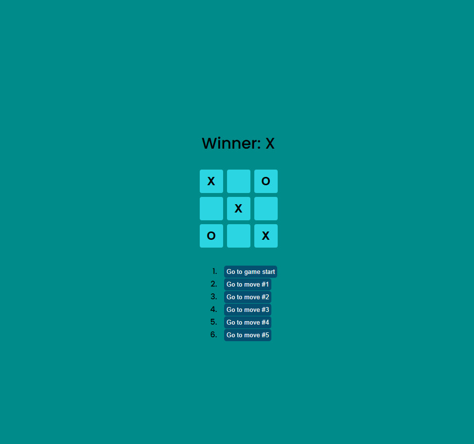

# Tic-Tac-Toe Game 🎲



## 📚 Опис проекту

Цей репозиторій є навчальною грою "Хрестики-Нулики" на React, що допомагає зрозуміти основи бібліотеки, включаючи:
- роботу з компонентами,
- управління станом (state),
- передачу пропсів,
- використання ключових концепції React.

#### Додаткові функції:

- Повідомлення про нічию: гра тепер визначає нічию та відображає відповідний результат.
- Анімація списку ходів: плавний ефект появи нових елементів списку.

## ⚙️ Основні технології
React: для створення інтерфейсу гри і навчання основам роботи з компонентами, пропсами та станом.

## 📖 Структура проекту
Проект складається з таких файлів і папок:

```
├── public
│   └── index.html        # Основний HTML-файл, що завантажує React додаток
└── src
    ├──components
        ├── Game.js           # Компонент, що керує логікою гри
        ├── Board.js          # Компонент, що представляє ігрову дошку
        ├── Square.js         # Компонент, що представляє окрему клітинку на дошці
    ├── App.jsx           # Головний компонент додатка
    ├── index.js          # Вхідний файл, що рендерить додаток в DOM
    └── styles.css        # CSS-файл для стилізації гри

```

## Sources
[React Tutorial](https://react.dev/learn/tutorial-tic-tac-toe#lifting-state-up-again)
